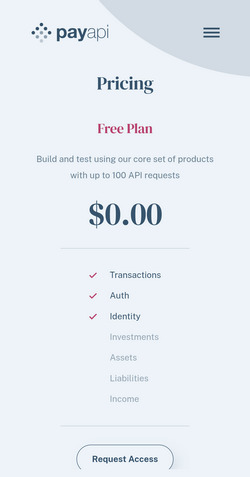
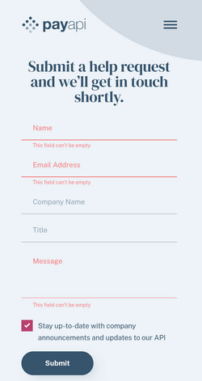

# Frontend Mentor - PayAPI multi-page website solution

This is a solution to the [PayAPI multi-page website challenge on Frontend Mentor](https://www.frontendmentor.io/challenges/payapi-multipage-website-FDLR1Y11e). Frontend Mentor challenges help you improve your coding skills by building realistic projects. 

### The challenge

During the project, the following functionality was implemented: users can view an optimized page layout based on the device's screen size, see the hover states of interactive elements, and receive error messages when submitting the contact form if the "Name," "Email," or "Message" fields are left blank (displaying "This field cannot be empty") or if the email address is entered in an incorrect format (displaying "Please enter a valid email address")."

### Screenshot

### Links

- Live Site URL: (https://sashayerokhov.github.io/PayApi-website/)

## My process

### Built with

- Semantic HTML5 markup
- CSS custom properties
- Flexbox
- CSS Grid

### AI Collaboration

I used Google's Gemini AI to help generate ARIA attributes for accessibility and improve JavaScript code.

## Author
- Frontend Mentor - [@SashaYerokhov](https://www.frontendmentor.io/profile/SashaYerokhov)

